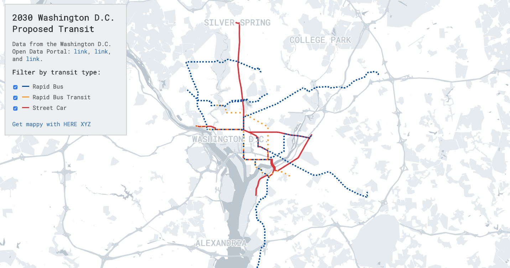

# DC Transit 2030


This is an interactive map of the proposed Washington D.C. public transit system. Data is available from the [DC Data Portal](http://opendata.dc.gov).

This map was made with [XYZ Hub API](https://www.here.xyz/api/), [Leaflet](https://leafletjs.com/), and [Tangram](https://github.com/tangrams/tangram).

## Live Demo

You can view a live demo of the map at: [dbabbs.github.io/dc-transit-2030](https://dbabbs.github.io/dc-transit-2030)

## Running locally

```
git clone https://github.com/dbabbs/dc-transit-2030.git
cd dc-transit-2030
python -m SimpleHTTPServer 8888
```
